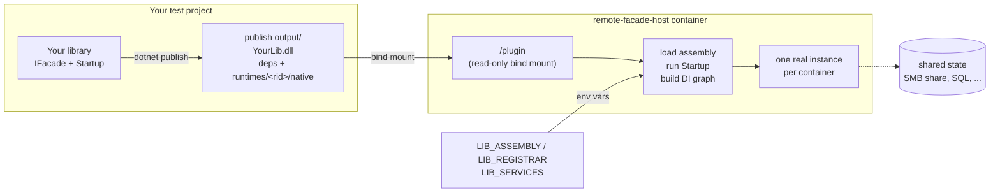
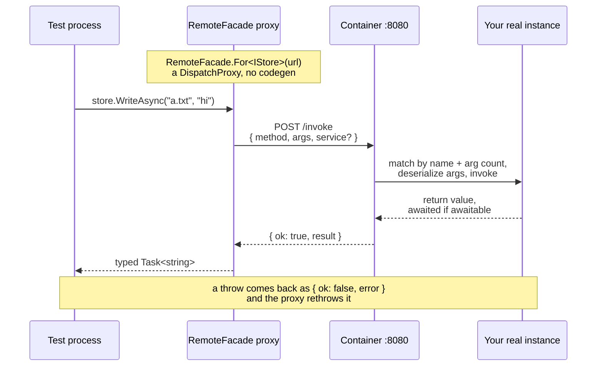

# remote-facade-host

**Run your real code inside a container, and call it from a test.**

Point this image at a `dotnet publish` output directory and a startup method.
It builds your service graph and exposes it over HTTP. Your test gets a typed
proxy and calls it like a local object.

The point is **several real instances at once**. Start two containers against
the same SMB share or database, drive both from one test, and you are testing
what actually happens in production — file locking, race conditions, stale
caches — instead of what a mock says happens.

```csharp
await using var host = RemoteHost.At(containerUrl);
var store = await host.GetAsync<IDocumentStore>();

await store.WriteAsync("a.txt", "hello");   // ran in the container
```

No code generation. Your test already references the library for its
interface, so a `DispatchProxy` implements it and the compiler checks the
contract.

> **v3 is breaking.** Single-class hosting (`LIB_TYPE`, `LIB_OPTIONS`) and the
> client's `RemoteFacade.For<T>(url)` are gone — a startup is the only way to
> host, `RemoteHost` the only way to call. Callbacks (`LIB_CALLBACKS`,
> `CallbackHost`) are out for now and preserved on the `callbacks` branch; use
> `LIB_SERVICES` to substitute a dependency meanwhile.

## Quick start

Write a startup — ordinary `IServiceCollection` wiring, the same as your app's:

```csharp
namespace MyApp;

public static class TestStartup
{
    public static void Configure(IServiceCollection services)
    {
        services.Configure<StoreOptions>(o => o.RootPath = "/mnt/share");
        services.AddSingleton<IDocumentStore, DocumentStore>();
    }
}
```

Publish it and run the image:

```bash
dotnet publish MyApp.csproj -o ./publish

docker run -v "$(pwd)/publish:/plugin:ro" \
  -e LIB_ASSEMBLY=MyApp.dll \
  -e LIB_REGISTRAR=MyApp.TestStartup.Configure \
  -p 8080:8080 ghcr.io/drewlane-dev/remote-facade-host:3.3.2
```

Then drive it. With [Testcontainers](https://dotnet.testcontainers.org/), the
whole thing is a fixture — see [`test/integration`](test/integration) for a
working one.

## How it works

Nothing is baked into the image and nothing is copied at build time: the host
mounts a publish directory and loads it at startup.



Every interface method becomes one HTTP POST, matched on the far side by name
and argument count.



## Configuration

| Variable | Default | Meaning |
|---|---|---|
| `LIB_ASSEMBLY` | **required** | Assembly file name inside `LIB_DIR`, e.g. `MyApp.dll`. |
| `LIB_REGISTRAR` | **required** | `Namespace.Type.Method` — a static method taking an `IServiceCollection`. Unset is a fatal startup error. |
| `LIB_DIR` | `/plugin` | Directory containing the publish output. |
| `LIB_SERVICES` | `{}` | Interface-to-implementation overrides, applied *after* the startup. See below. |
| `LIB_PORT` | `8080` | Port to listen on. |

### Mounting an SMB share

Optional, and off unless `SMB_SERVER` **and** `SMB_SHARE` are both set —
setting only one is a fatal error, not a silent no-op, because a library that
expected a mount and didn't get one would write to the container's own disk
and pass tests while proving nothing.

| Variable | Default |
|---|---|
| `SMB_SERVER`, `SMB_SHARE` | unset |
| `SMB_USER`, `SMB_PASS` | `azure` / `Passw0rd!` |
| `SMB_MOUNT_POINT` | `/mnt/share` |
| `SMB_MOUNT_OPTIONS` | `vers=3.1.1,uid=0,gid=0,file_mode=0777,dir_mode=0777,serverino,nosharesock,actimeo=30,mfsymlinks,seal` |

Mounting needs extra capabilities:

```bash
docker run --cap-add SYS_ADMIN --cap-add DAC_READ_SEARCH \
  --security-opt apparmor=unconfined \
  -e SMB_SERVER=samba -e SMB_SHARE=data ...
```

## HTTP API

`RemoteHost` speaks this for you; it is here for when you need to look.

| | |
|---|---|
| `GET /health` | `{"registrar":"MyApp.TestStartup.Configure"}` once serving. |
| `GET /services` | Every registered service type name. |
| `GET /types` | Every public type in the assembly — for when a name is wrong. |
| `POST /invoke` | `{"service","method","args"}` → `{"ok":true,"result":…}` or `{"ok":false,"error":"…"}`. |
| `DELETE /instance` | Rebuilds the graph, discarding all state. Returns 204. |

**Errors never arrive as a bare 500 with an empty body.** A method that throws,
an argument that will not deserialize, a service that is not registered — all
come back as `{"ok":false,"error":…}` naming the cause. A missing service
lists what *is* registered.

Every awaitable shape works: `Task`, `Task<T>`, `ValueTask`, `ValueTask<T>`,
and plain synchronous returns. An async method hands its `Task` back before
the round trip completes, so `Task.WhenAll(a.X(), b.X())` really does overlap
two containers.

## Testcontainers helpers

`RemoteFacade.Testcontainers` collapses the container setup into a few calls.
It is a **separate package** so `RemoteFacade.Client` stays free of any
container dependency — install it only if you drive containers with
Testcontainers.

```csharp
await using var container = new ContainerBuilder()
    .WithImage("ghcr.io/drewlane-dev/remote-facade-host:3.3.2")
    .WithRemoteFacade(typeof(TestStartup), pluginDir)
    .WithOptions(new StoreOptions { RootPath = "/mnt/share" })
    .WithSmbMount(new SmbMount { Server = "samba", Share = "data" })
    .Build();

await container.StartAsync();
await using var host = container.RemoteHost();
```

| | |
|---|---|
| `WithRemoteFacade` | Bind mount, `LIB_DIR`, `LIB_ASSEMBLY`, `LIB_REGISTRAR`, a random port binding, and a wait on `/health` — not on the port, which is bound before the graph is built. Throws if the plugin directory does not exist, since a missing one bind-mounts as an empty one. Pass `transport: PluginTransport.Copy` when the **test itself** runs in a container: a bind mount there names a path on the Docker host, and the container silently gets an empty directory. |
| `WithOptions` | The same typed push-down as above, straight onto the builder. |
| `WithSmbMount` | Credentials plus the privileges a cifs mount needs: `SYS_ADMIN`, `DAC_READ_SEARCH`, and `apparmor=unconfined`. Without them the mount fails with a message that mentions none of them. |
| `RemoteHost()` | A client on the **mapped** port, so there is no hostname/port string to get subtly wrong. |

> If you want the plugin-publish MSBuild target, reference **`RemoteFacade.Client`
> directly too**. NuGet does not flow build assets through a transitive
> dependency, so referencing only this package leaves the target silently
> unimported.

## Pushing config into the container

Options travel as environment variables, written from a typed object and bound
back with stock `IConfiguration`. The **options type is the only shared
symbol** — rename it and the compiler breaks both ends.

**In the fixture:**

```csharp
var env = RemoteHostEnvironment.For(typeof(TestStartup))
    .WithOptions(new StoreOptions { RootPath = "/mnt/share", Retries = 5 });

foreach (var (key, value) in env)
    builder = builder.WithEnvironment(key, value);
```

That emits `StoreOptions__RootPath` and `StoreOptions__Retries` — the shape
`AddEnvironmentVariables()` reads. The section defaults to the type's short
name; pass one explicitly to override it.

**In the startup:**

```csharp
services.BindOptions<StoreOptions>();
```

Or the same thing without this package, if you prefer nothing bespoke in your
wiring:

```csharp
var config = new ConfigurationBuilder().AddEnvironmentVariables().Build();
services.Configure<StoreOptions>(config.GetSection(nameof(StoreOptions)));
```

What `BindOptions` adds is a guard: a section the fixture never set is a
**startup failure**, not a silent fall back to defaults. Pass `optional: true`
to accept the defaults deliberately. It is also the *smaller* dependency for a
plain class library — the two stock lines need
`Microsoft.Extensions.Configuration.EnvironmentVariables` and
`Microsoft.Extensions.Options.ConfigurationExtensions`, both of which this
package already brings in.

Nested objects and collections work (`Tags__0`, `Nested__Name`), enums travel
as names so `docker inspect` stays readable, and a **null property emits
nothing** — meaning "keep whatever the startup decided", since an environment
variable cannot distinguish absent from empty.

Bare values that are not an options class keep using `WithEnvironment`.

> Environment variables are visible in `docker inspect`. That is the same
> exposure the old `LIB_OPTIONS` had and it is fine for test containers, but
> do not put a production secret through it — read those from a mounted file
> inside the startup instead.

## Substituting a dependency

`LIB_SERVICES` maps an interface to an implementation, both resolved from the
plugin assembly, applied *after* your startup runs:

```
-e LIB_SERVICES='{"MyApp.IClock":"MyApp.Testing.FixedClock"}'
```

Real wiring, one thing faked — without the plugin knowing it is under test.
The fake must be a type in the plugin assembly.

## Things worth knowing

**`Scoped` registrations are refused.** A remote call has no scope to live in.
The error says so and names the service. Register it `Singleton` or
`Transient`, or resolve it inside a method on something that is.

**One graph per container, for its lifetime.** That is what lets one call take
a lock and a later call release it. `DELETE /instance` resets between tests;
proxies you already hold keep working, because services resolve per call.

**Native dependencies just work.** A plugin carrying `runtimes/<rid>/native`
(LibGit2Sharp, SkiaSharp, SQLitePCLRaw) loads with no configuration — no
`LD_LIBRARY_PATH`, no knowing the image's RID. The image is Alpine, so the RID
is `linux-musl-*`; a package shipping only `linux-x64` will not load, and the
error says so, naming the library and every directory searched.

**Globalization is enabled.** Alpine .NET images run in invariant mode by
default, where anything culture-aware throws *"Globalization Invariant Mode is
not supported"*. `Microsoft.Data.SqlClient` raises it on the first CONNECTION,
long after the assembly loaded fine, so it reads as a database fault rather
than an image one. The image ships ICU and turns invariant mode off.

**RID-specific assemblies resolve too.** A package that ships a reference stub
at its root and the real build under `runtimes/<rid>/lib` — `Microsoft.Data.SqlClient`
is the common one — works without configuration. Those are normally chosen from
the app's `deps.json`, which a plugin loaded by `Assembly.LoadFrom` never gets,
so the host preloads them from the plugin's own `runtimes` folder before
loading it. Without that, SqlClient's root stub loads and every call fails with
*"Microsoft.Data.SqlClient is not supported on this platform."*

**Host and plugin share a load context.** So `typeof(IOptions<>)` means the
same thing on both sides and constructor matching works. The cost: you must
agree on versions of shared packages (`Microsoft.Extensions.*`). A mismatch
shows up as a confusing "no constructor found".

**VB libraries work unchanged.** A `Public Module` gives you the static
`Configure` the host needs. Watch the names: VB *prepends* `RootNamespace` to
declared namespaces, so your type may be `VbLib.VbLib.VbStore`. `GET /types`
will tell you.

## Testing this image

Three suites, deliberately not interchangeable:

```bash
dotnet test test/unit/RemoteFacade.UnitTests/RemoteFacade.UnitTests.csproj

docker build -t remote-facade-host:dev .
./test/run.sh remote-facade-host:dev
dotnet test test/integration/RemoteFacade.IntegrationTests/RemoteFacade.IntegrationTests.csproj
```

| Suite | Covers | Why it can't be one of the others |
|---|---|---|
| unit | logic — `InstanceHolder`, `Invoker`, `NativeResolver`, the client | Reset-during-a-call and racing resets can't be timed reliably over HTTP; a test that hopes the interleaving lands proves nothing when it passes. |
| `test/run.sh` | the wire, with `curl` | Only a byte comparison against the previous release catches a dropped field. |
| integration | the composition path through `RemoteHost` | `run.sh` speaks the protocol with `curl`, so it never exercises the client package consumers depend on. |

`test/baseline.sh` compares `/invoke` responses byte-for-byte against the
published `2.1.0` image — the last release that speaks both configurations,
and so the only one a v3 host can be compared against. The integration suite honours `REMOTE_FACADE_IMAGE`
so CI can point it at the tag it just built.

## Releasing

Push a `v*` tag. [`release.yml`](.github/workflows/release.yml) runs all three
suites, then publishes the multi-arch image to GHCR and `RemoteFacade.Client`
to nuget.org via Trusted Publishing. The client and the image are two halves
of one wire protocol, so they carry the same version and ship from the same
tag.
