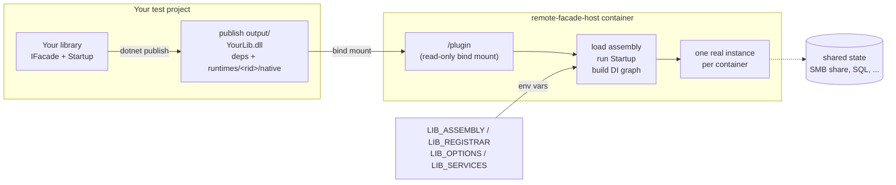
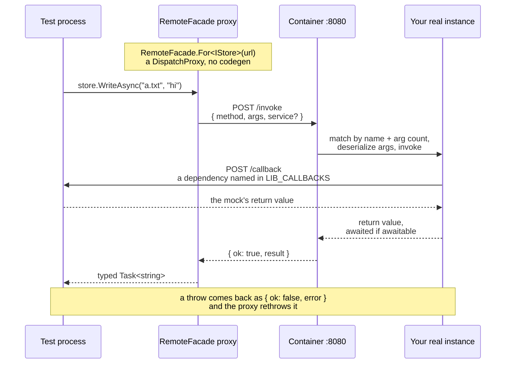

# remote-facade-host

A container image that loads any .NET assembly and exposes it over HTTP, so an
integration test can drive **several real instances** of a library or a whole
composition root — each in its own container, each against shared state (a
database, an SMB share, whatever the code actually talks to) — the way a real
deployment does.

One image serves every plugin. Nothing library-specific is baked in: you
mount a `dotnet publish` output directory, tell the host what to construct,
and it starts answering calls.

There are two ways to tell it that.

## How it works

**Getting your code into the container.** Nothing is built into the image and
nothing is copied at build time: the host mounts a publish output directory and
loads it at startup.



Run two containers against the same share and you have two real SMB clients
contending for real files — which is the point.

**Calling it.** `RemoteFacade.For<T>(url)` hands back a `DispatchProxy`. There
is no generated client and no codegen step: every method on your interface
becomes one HTTP POST, matched on the far side by name and argument count.



The callback arrow is the reverse direction: a dependency you name in
`LIB_CALLBACKS` is proxied *back* to your test process, so a mock stays where
your assertions are instead of being stranded inside the container.

## Two ways to host

**Composition-root hosting** points the container at your application's own
DI startup — the same `IServiceCollection` wiring your app already has — and
lets a test resolve whatever service it needs by interface. Choose this when
the wiring is non-trivial (more than a couple of constructor dependencies,
factories, real lifetimes) or when a test needs more than one surface out of
the same container.

**Single-instance hosting** constructs one class directly from `LIB_TYPE` and
`LIB_OPTIONS`. Choose this for one simple class with simple configuration —
it's less to set up when a composition root would be overkill.

Both modes share the same wire protocol, the same pass-by-value boundary, and
the same `DELETE /instance` reset. Composition-root hosting is the primary
path; read that section first even if a single instance is all you need
today; the pieces that come up in it (the boundary, `GET /services`, reset
semantics) apply to both.

## Composition-root hosting

Point the container at a static method that wires an `IServiceCollection`
exactly the way your application's own `Startup`/`Program.cs` does:

```csharp
namespace MyApp;

public static class GraphStartup
{
    public static void Configure(IServiceCollection services)
    {
        services.AddSingleton<IDocumentStore, DocumentStore>();
        services.AddSingleton<IRootFacade, RootFacade>();
        // ... the rest of the app's real wiring, unchanged.
    }
}
```

Two environment variables point the container at it — and that's all it
needs; **`LIB_OPTIONS` is not consulted in this mode**, because there's no
single root type to derive an `IOptions<T>` constructor parameter from. Bind
whatever options your own startup needs the same way your app already does
(`services.Configure<T>(...)`, `Options.Create(...)`, etc.), inside
`Configure` itself:

```
docker run \
  -v "$(pwd)/publish:/plugin:ro" \
  -e LIB_DIR=/plugin -e LIB_ASSEMBLY=MyApp.dll \
  -e LIB_REGISTRAR=MyApp.GraphStartup.Configure \
  ... remote-facade-host
```

Leaving `LIB_TYPE` unset is what selects this mode — the host requires
*either* `LIB_TYPE` *or* `LIB_REGISTRAR`, never neither. From the test
process, use `RemoteHost` (from the `RemoteFacade.Client` package) to resolve
services by interface:

```csharp
using RemoteFacadeHost.Client;

await using var host = RemoteHost.At("http://instance-a:8080");

var facade = await host.GetAsync<IRootFacade>();
Console.WriteLine(facade.Who());          // runs in the container

await host.ResetAsync();                  // rebuilds the whole graph
```

`GetAsync<T>` round-trips to `GET /services` before returning the proxy, so a
typo or a missing registration fails right there — naming the interface and
listing what *is* registered — rather than later, confusingly, at the first
method call. `RemoteHost` has no public constructor: `At(string)` is the only
supported way to build one. That's deliberate, not an oversight —
`DisposeAsync` unconditionally disposes the `HttpClient` it created, with no
ownership flag, so a public constructor would let two `RemoteHost`s share a
client and have the first one's disposal silently break the second. Verified
by reflection in `test/fixtures/GraphClient/Program.cs`, which asserts
`typeof(RemoteHost).GetConstructors(...)` is empty.

A small helper, `RemoteHostEnvironment.For(Type, string?)`, builds the
`LIB_ASSEMBLY`/`LIB_REGISTRAR` dictionary from the startup type itself, so a
typo in the registrar string can't slip past the compiler:

```csharp
var env = RemoteHostEnvironment.For(typeof(GraphStartup));
// env["LIB_ASSEMBLY"]  == "MyApp.dll"
// env["LIB_REGISTRAR"] == "MyApp.GraphStartup.Configure"
```

It takes a `Type`, not a generic type parameter, deliberately: a startup is a
holder for a static registration method, so it is itself almost always
declared `static class` (as `GraphStartup` above is) — and C# refuses a
static type as a generic type argument (`CS0718`), full stop. `typeof(X)` is
exactly as compile-time-checked as a type argument would be — `X` must exist
and be spelled correctly — without excluding the one shape this helper exists
to serve. Verified against the real, `static class GraphStartup` above via
`test/fixtures/GraphClient`, which asserts both dictionary values. The named
method must also actually be `static`; an instance method of the right name
is rejected here rather than failing later, confusingly, when the container
has no instance to invoke it on.

### The facade pattern

A composition root's most useful services are rarely narrow value types —
they're the real objects your app built, with real dependencies wired in by
`Configure`. Expose those through a small facade interface that takes and
returns simple values, and let the container keep the complex objects on its
own side:

```csharp
public interface IRootFacade
{
    string Who();
}
```

The next section explains why: an object with methods does not survive the
trip across `/invoke` the way you might expect from an in-process call.

## The boundary

This is a test affordance, not an RPC framework: no auth, no retries, no
streaming, no versioned contract.

**Arguments and return values cross by value, as JSON — never by
reference.** This is the one thing every consumer of this image needs to
internalize before writing a facade.

Measured directly against a plugin class shaped like this:

```csharp
public class Counter
{
    public int Count { get; set; }
    public string Bump() { Count++; return $"bumped to {Count}"; }
}

public interface IFacade
{
    string Poke(Counter c);
}
```

```csharp
var counter = new Counter { Count = 5 };
var result = facade.Poke(counter);   // proxy call over /invoke

Console.WriteLine(result);           // "bumped to 6"
Console.WriteLine(counter.Count);    // 5 -- unchanged
```

The container deserializes its own, brand-new `Counter` from the JSON
`{"Count":5}`, calls `Bump()` on *that* copy, and serializes the string
result back. The caller's `counter` was never touched — it lives in a
different process, and the only thing that ever crossed the wire was its
data at the moment of the call. Over raw HTTP, the same round trip looks
like:

```
$ curl -X POST http://host:8080/invoke -H 'Content-Type: application/json' \
    -d '{"method":"Poke","args":[{"Count":5}]}'
{"ok":true,"result":"bumped to 6"}
```

**An interface (or abstract class) argument fails outright, loudly, before
the method ever runs** — `System.Text.Json` has nothing to construct:

```
$ curl -X POST http://host:8080/invoke -H 'Content-Type: application/json' \
    -d '{"method":"UseThing","args":[{}]}'
{"ok":false,"error":"argument 's' (ISomething): Deserialization of interface
or abstract types is not supported. Type 'MyApp.ISomething'. Path: $ |
LineNumber: 0 | BytePositionInLine: 1."}
```

This is exactly why the facade pattern (above) matters for composition-root
hosting: a facade method that took, say, an `IDocumentStore` argument instead
of returning one could never be called at all. Keep complex objects —
anything with behavior, anything the startup built through DI — on the
container's side of the line. A facade method should take and return plain
values (strings, numbers, records of plain values, collections of those) and
reach into the composition root's own services internally, where the objects
already live.

Two shapes are actively **rejected** by `Invoker` before the method ever
runs, with a message naming the method and the reason:

- **`ref` / `out` / `in` parameters.** `{"ok":false,"error":"method '<name>'
  has ref parameter '<param>'; ref/out/in parameters cannot cross /invoke"}`
  (`out parameter` / `in parameter` for the other two kinds).
- **Open generic methods** (e.g. `T Echo<T>(T value)`, called with no type
  argument to close over). `{"ok":false,"error":"method '<name>' is an open
  generic method; /invoke has no way to supply type arguments, so it cannot
  be called"}`.

Everything else is attempted rather than pre-checked: every argument and
every return value is bound or serialized with `System.Text.Json` as it's
needed, and a type it refuses — `System.Type`, `Stream`, an interface, an
object cycle, and so on — fails right there, inside the same guarded path,
with a purpose-built message naming what failed:

- A bad argument: `{"ok":false,"error":"argument '<name>' (<Type>): <the
  System.Text.Json message>"}`.
- A bad return value: `{"ok":false,"error":"return value of '<method>'
  (<Type>): <the System.Text.Json message>"}` — for example, a method
  declared to return `System.Type` produces `{"ok":false,"error":"return
  value of 'BadReturn' (Type): Serialization and deserialization of
  'System.RuntimeType' instances is not supported. Path: $."}`.

A failure *before* the method — resolving the service a call names — is
enveloped the same way. `Resolve`'s own misses (not a type in the assembly,
not registered, registered `Scoped`) go out verbatim, since they already name
the service and list what is registered. Anything else out of the container is
the plugin's own code throwing, almost always a service **constructor**, and
is attributed to the service it came from:

```
{"ok":false,"error":"cannot resolve service 'MyApp.IThing': ArgumentException:
wiring is wrong: no connection string"}
```

None of these ever reaches the caller as a bare HTTP 500 with an empty body.

## `Scoped` services

`GraphStartup.Configure` may register a service `AddScoped` — a real ASP.NET
Core `IServiceCollection` accepts it — but **a remote call has no scope for
it to live in**, and it is rejected. The important, measured detail is
*when*:

- **`GET /services` still lists it.** The endpoint reports every registered
  service type name; it doesn't filter by lifetime.
- **`RemoteHost.GetAsync<T>()` still succeeds.** Its registration check only
  inspects `GET /services`, and a Scoped registration passes that check.
- **The rejection happens on the first actual method call**, inside
  `HostedGraph.Resolve`, which `/invoke` consults per call:

```
$ curl -X POST http://host:8080/invoke -H 'Content-Type: application/json' \
    -d '{"service":"CsLib.IScopedThing","method":"Say","args":[]}'
{"ok":false,"error":"service 'CsLib.IScopedThing' is registered Scoped, and a
remote call has no scope to live in. Register it Singleton or Transient, or
resolve it inside a method on a service that is."}
```

Confirmed end-to-end against a real `RemoteHost`-driven proxy
(`test/fixtures/GraphClient`): `GetAsync<IScopedThing>()` returns
successfully, and the exception above only surfaces once a method is called
on the resulting proxy.

**Two shapes escape this guard**, and the limit is worth knowing because the
result is a service quietly served from the root container rather than an
error. An **open-generic** scoped registration (`services.AddScoped(typeof(
IRepo<>), typeof(Repo<>))`) is keyed on the open type name, while `/invoke`
names the closed one, so the two never match and the call is served. A
**captive dependency** — a `Singleton` whose constructor takes a `Scoped`
service — is served too, capturing that scoped instance for the container's
lifetime; the guard is about the *directly named* service, and
`BuildServiceProvider()` is called without `ValidateScopes`. Both fail safe
(a singleton-lifetime instance, not corruption) and both are known,
deliberately deferred limits rather than oversights.

If a service registered both `AddScoped` and `AddSingleton` for the same
interface (without `Replace`), rejection follows whichever registration
actually **wins** resolution — the last one registered, which is how .NET's
own container resolves it — not "any matching descriptor is Scoped." A
singleton registered after a scoped one for the same interface is served
normally.

## Single-instance hosting (the quick path)

For one class with simple configuration, skip the composition root entirely:

```csharp
using RemoteFacadeHost.Client;

var store = RemoteFacade.For<IDocumentStore>("http://instance-a:8080");
await store.WriteAsync("doc.json", payload);   // runs in the container
```

`RemoteFacade.For<T>` (from the `RemoteFacade.Client` package, namespace
`RemoteFacade.Client`) returns a `DispatchProxy` implementing `T`. No code
generation: your test project already references the library for its
interface, the compiler enforces the contract, and nothing regenerates when
the interface changes.

Async calls are genuinely concurrent: the proxy returns the in-flight
operation rather than blocking, so `Task.WhenAll(a.WriteAsync(...),
b.WriteAsync(...))` really does overlap two instances. That is the point of the
image — a contention test that secretly serialises its two clients proves
nothing.

The consequence is that an async call you never await may not complete. The
container is doing the work, not your test process, so an un-awaited `Task` can
outlive the assertion that was supposed to depend on it. Await every call, or
hold the `Task` and await it later.

`LIB_TYPE` names the type to construct, and it is no longer required to be a
concrete class: **it may name an interface, resolved from the provider**,
provided something registers an implementation for it (`LIB_SERVICES` or
`LIB_REGISTRAR`). Measured directly:

```
-e LIB_TYPE=CsLib.IRootFacade -e LIB_REGISTRAR=CsLib.GraphStartup.Configure
```

```
$ curl http://host:8080/health
{"type":"CsLib.IRootFacade"}
$ curl -X POST http://host:8080/invoke -H 'Content-Type: application/json' \
    -d '{"method":"Who","args":[]}'
{"ok":true,"result":"root-facade"}
```

`LIB_TYPE` and `LIB_REGISTRAR` can be combined this way: the registrar wires
the graph, and `LIB_TYPE` names the (possibly interface) root to serve every
call against directly, without a `service` field.

Methods the named interface **inherits** from a base interface are callable
too — `IDerived : IBase` serves `IBase`'s members as well as its own, on both
this path and the `service` field. Splitting a facade across interfaces is
ordinary C#, and both directions of the protocol treat an inherited member as
part of the contract.

One caveat on configuration. An interface has no constructor, so `LIB_OPTIONS`
is bound from the constructor of the **implementation**, taken from the
`LIB_SERVICES` entry that names it:

```
-e LIB_TYPE=CsLib.IStore -e LIB_OPTIONS='{"RootPath":"/mnt/share"}' \
-e LIB_SERVICES='{"CsLib.IStore":"CsLib.Store"}'
```

If the implementation is registered only by `LIB_REGISTRAR`, this host cannot
identify it without inspecting service descriptors — which it deliberately
does not do — so a non-empty `LIB_OPTIONS` in that shape is a fatal startup
error naming both variables, rather than the implementation quietly receiving
default options. Configure those options in your registrar instead.

That error fires on exactly one shape: **an interface `LIB_TYPE` with no
`LIB_SERVICES` entry for it**, and a non-empty `LIB_OPTIONS`. A named
implementation is accepted whether or not it happens to ask for an
`IOptions<T>`, and a concrete `LIB_TYPE` is never affected — one that cannot
be constructed still fails with the constructor message that names the real
mistake.

## Security

**`/invoke` executes arbitrary methods on whatever assembly is loaded, with
whatever arguments the caller sends.** There is no auth, no allowlist, no
sandboxing beyond the container boundary. This image is for test networks
only — never expose it to anything you don't fully trust.

The callback listener has the same posture, in the other direction, and it runs
in **your own test process** rather than in a container. `CallbackHost.Start(port)`
binds `0.0.0.0:<port>` — every interface on the machine, not just loopback — and
`POST /callback` is unauthenticated: anything that can reach that port can invoke
the mocks you registered. Dispatch is restricted to the method table of the
interface passed to `Serve<T>` (and the interfaces it inherits), so a target's
other public methods, and `Object`'s own members such as `ToString()`, are not
reachable — but everything the served interface declares is, with whatever
arguments the caller sends. Run it on a trusted network only, and give it a port
you are willing to expose for the lifetime of the fixture.

## Configuration

| Variable | Default | Meaning |
|---|---|---|
| `LIB_DIR` | `/plugin` | Directory containing the plugin's `dotnet publish` output. |
| `LIB_ASSEMBLY` | *(required)* | Assembly file name inside `LIB_DIR`, e.g. `CsLib.dll`. |
| `LIB_TYPE` | unset | Fully-qualified name of the type (or, if registered, interface) to construct. Selects single-instance mode. Either this or `LIB_REGISTRAR` is required; setting neither is a fatal startup error naming both variables. |
| `LIB_OPTIONS` | `{}` | JSON bound into whatever `IOptions<T>` the root asks for. Only consulted when `LIB_TYPE` is set — composition-root mode (no `LIB_TYPE`) ignores it, since there is no single root to bind for. When `LIB_TYPE` names an **interface**, the options come from the constructor of the implementation `LIB_SERVICES` names for it; an implementation supplied only by `LIB_REGISTRAR` cannot be found this way, so an interface `LIB_TYPE` with no `LIB_SERVICES` entry and a non-empty `LIB_OPTIONS` is a **fatal startup error** rather than silently ignored — configure those options inside your registrar instead. A concrete `LIB_TYPE`, or an interface that *is* named in `LIB_SERVICES`, is never refused by that check. |
| `LIB_SERVICES` | `{}` | JSON map of interface name to implementing type name, both resolved from the plugin assembly — see [Substituting a dependency](#substituting-a-dependency). |
| `LIB_REGISTRAR` | unset | `Namespace.Type.Method` naming a static method that takes an `IServiceCollection`, for wiring the host can't express declaratively. Runs *before* `LIB_SERVICES`, so the explicit map can still override anything it registers. Leaving `LIB_TYPE` unset while this is set selects composition-root mode. |
| `LIB_CALLBACKS` | `{}` | JSON map of interface name to an HTTP base URL on the test runner — see [Substituting a dependency](#substituting-a-dependency). |
| `LIB_PORT` | `8080` | HTTP port the host listens on. |
| `SMB_SERVER` | unset | SMB server to mount before serving. Must be set together with `SMB_SHARE`. |
| `SMB_SHARE` | unset | Share name. |
| `SMB_USER` | `azure` | Mount credential. |
| `SMB_PASS` | `Passw0rd!` | Mount credential. |
| `SMB_MOUNT_POINT` | `/mnt/share` | Where the share is mounted. |
| `SMB_MOUNT_OPTIONS` | `vers=3.1.1,uid=0,gid=0,file_mode=0777,dir_mode=0777,serverino,nosharesock,actimeo=30,mfsymlinks,seal` | Passed to `mount -t cifs` as `-o`. |

Mounting is entirely optional — a library that talks to, say, a SQL database
needs no share at all, and a host serving it needs no elevated capabilities.
It only activates when `SMB_SERVER` and `SMB_SHARE` are **both** set (setting
only one is a fatal startup error, not a silent no-op, since a library that
expects a mount and silently doesn't get one would write to the container's
own filesystem instead — passing tests while proving nothing). When it does
activate, the container needs `CAP_SYS_ADMIN` and `CAP_DAC_READ_SEARCH`, plus
(at least under Docker's default AppArmor profile) `--security-opt
apparmor=unconfined`:

```
docker run --cap-add SYS_ADMIN --cap-add DAC_READ_SEARCH \
  --security-opt apparmor=unconfined \
  -e SMB_SERVER=samba -e SMB_SHARE=data \
  ...
```

## HTTP API

Bodies below were captured from real containers: `CsLib.Store` (the `IStore`
fixture under `test/fixtures/CsLib`, single-instance mode) for `/health`,
`/types` and the base `/invoke` shape, and `CsLib.GraphStartup` (composition
root, `LIB_REGISTRAR=CsLib.GraphStartup.Configure`, no `LIB_TYPE`) for
`/services` and the `service`-qualified `/invoke` shape.

### `GET /health`

```
$ curl http://host:8080/health
{"type":"CsLib.Store"}
```

Returns the constructed type's full name — `null` in composition-root mode,
where nothing is constructed up front. A 200 here means the host is ready to
serve `/invoke`.

### `GET /types`

```
$ curl http://host:8080/types
["CsLib.IStamp","CsLib.RealStamp","CsLib.FakeStamp","CsLib.Inner","CsLib.FakeInner",
 "CsLib.Outer","CsLib.Configured","CsLib.ConfiguredFromFactory","CsLib.NeedsConfigured",
 "CsLib.Registration","CsLib.IStore","CsLib.StoreOptions","CsLib.Store"]
```

Every public type the loaded assembly actually exports. This exists because a
wrong `LIB_TYPE` is otherwise a dead end — see [the VB note](#a-note-for-vb-libraries)
below for the case that motivated it.

### `GET /services`

```
$ curl http://croot:8080/services
["Microsoft.Extensions.Options.IOptions`1","Microsoft.Extensions.Options.IOptionsSnapshot`1",
 "Microsoft.Extensions.Options.IOptionsMonitor`1","Microsoft.Extensions.Options.IOptionsFactory`1",
 "Microsoft.Extensions.Options.IOptionsMonitorCache`1","Microsoft.Extensions.Logging.ILoggerFactory",
 "Microsoft.Extensions.Logging.ILogger`1",
 "Microsoft.Extensions.Options.IConfigureOptions`1[[Microsoft.Extensions.Logging.LoggerFilterOptions, ...]]",
 "CsLib.StringRooted","CsLib.IRootFacade","CsLib.IScopedThing","CsLib.IExplicitThing",
 "CsLib.IScopedThenSingleton","CsLib.ICounter"]
```

The full names of every registered service type — **exactly what
`GraphStartup.Configure` (plus `AddLogging()`, which the host always calls)
put in the container, framework internals included, not a curated list of
just your own interfaces.** Expect noise from the DI/logging/options
machinery ahead of your own types, as above. This is the list
`RemoteHost.GetAsync<T>()` checks membership against, and it includes
`Scoped` registrations — see [`Scoped` services](#scoped-services) for why
that doesn't mean a `Scoped` service is actually callable.

### `POST /invoke`

```
$ curl -X POST http://host:8080/invoke -H 'Content-Type: application/json' \
    -d '{"method":"ReadAsync","args":["doc.json"]}'
{"ok":true,"result":"hello world"}

$ curl -X POST http://host:8080/invoke -H 'Content-Type: application/json' \
    -d '{"method":"FailAsync","args":[]}'
{"ok":false,"error":"deliberate failure for the async-exception test"}

$ curl -X POST http://host:8080/invoke -H 'Content-Type: application/json' \
    -d '{"method":"Nope","args":[]}'
{"ok":false,"error":"no method 'Nope' taking 0 argument(s)"}
```

Calls a method by name, matching by name and argument count. Arguments are
JSON, deserialized into the method's parameter types; the result — whatever
the return value is — comes back as `result`. `void`, `Task`, `T`, and
`Task<T>` all round-trip; the client and host negotiate no other shape. A
thrown exception (sync or from a faulted `Task`) comes back as
`{"ok":false,"error":"<the exception's own Message>"}` instead of an
unhandled 500.

**In composition-root mode** (no `LIB_TYPE`), there is no single instance to
dispatch against, so the request must name which registered service it
wants, via a `service` field carrying the service's full type name:

```
$ curl -X POST http://croot:8080/invoke -H 'Content-Type: application/json' \
    -d '{"service":"CsLib.IRootFacade","method":"Who","args":[]}'
{"ok":true,"result":"root-facade"}

$ curl -X POST http://croot:8080/invoke -H 'Content-Type: application/json' \
    -d '{"method":"Who","args":[]}'
{"ok":false,"error":"this host is in composition-root mode (no LIB_TYPE), so a
call must name the service it wants in the \"service\" field."}
```

An unregistered or unknown `service` names itself and lists what *is*
registered, the same way an unrecognized `LIB_TYPE` does at startup:

```
$ curl -X POST http://croot:8080/invoke -H 'Content-Type: application/json' \
    -d '{"service":"CsLib.IStamp","method":"Value","args":[]}'
{"ok":false,"error":"service 'CsLib.IStamp' is not registered. Registered
services: Microsoft.Extensions.Options.IOptions`1, ..., CsLib.IRootFacade,
CsLib.IScopedThing, CsLib.IExplicitThing, CsLib.IScopedThenSingleton,
CsLib.ICounter"}
```

`RemoteFacade.For<T>` (single-instance mode) never sends a `service` field —
its wire format is pinned byte-for-byte against the original single-instance
protocol. `RemoteHost.GetAsync<T>()` (composition-root mode) always sends
one, resolved from the interface `T` was asked for.

### `DELETE /instance`

```
$ curl -i -X DELETE http://host:8080/instance
HTTP/1.1 204 No Content
```

**Rebuilds the entire graph** — not just the root instance, but the whole DI
provider and every singleton in it — from the same configuration, then
serves every later call against the new one. In single-instance mode this
was already true of the one constructed object; in composition-root mode it
means *every* registered singleton is new, which is the only way to actually
observe a rebuild happened rather than a plain re-resolve: a singleton
counter that reached 2 within one graph reads 1 again immediately after
reset.

It does **not** reset anything written outside the process — a file already
written to a mounted share stays written. Only object identity and in-memory
state inside the container are new.

**Safe against calls already in flight, measured directly.** A reset retires
the current graph and publishes a fresh one immediately; a call already
running against the old graph keeps running against it — the old graph is
disposed only once its last in-flight call finishes, never out from under
one. Before this guarantee existed, two calls in flight across one `DELETE
/instance` both came back
`{"ok":false,"error":"Cannot access a disposed object. Object name:
'IServiceProvider'."}` — an error attributed to nothing the caller did,
arriving on a call it had already made.

**An instance-registered root is deliberately not disposed on reset.** If a
composition root registers a ready-made object —
`services.AddSingleton<Root>(existingInstance)` — rather than a type or a
factory, `DELETE /instance` does **not** call `Dispose()` on it, even if it's
`IDisposable`. This follows .NET's own rule for its container: a provider
disposes what it *created*; an instance it was merely handed is not
something it created, so it isn't tracked for disposal — same as in any
ordinary ASP.NET Core app. Confirmed by running exactly this shape end to
end: `DELETE /instance` returns `204`, and the disposal sentinel the plugin's
`Dispose()` would have written never appears. If a reset needs to release
whatever a root holds, register it as a type (`services.AddSingleton<Root>()`)
or a factory instead — either is provider-owned and gets disposed normally.

**A plugin `Dispose()` that throws** is handled differently depending on
whether anything is still in flight when it runs. On the deferred path — the
retired graph's last in-flight call is the one that ends up disposing it —
the throw is caught and written to the container's own stderr, never
propagated: that caller's request had already succeeded, and letting the
throw unwind would turn a successful response into an empty 500 for a call
that had nothing to do with the failure. Confirmed on the other path too:
with nothing in flight, `Reset()` disposes synchronously on the `DELETE`
request itself and does **not** swallow — the response is `500`, because the
operator who asked for the reset is the one who should be told their
plugin's `Dispose()` is broken.

**A non-204 from `DELETE /instance` does not mean the reset failed.** The
swap happens first, inside the lock; the retired graph is disposed afterwards,
outside it. So a `500` here reports a failure *during teardown of the old
graph* — the new graph is already built, already published, and already
serving. A fixture that treats `ResetAsync()` throwing as "the reset didn't
happen, abort" is drawing the wrong conclusion, and one that retries will
reset twice.

## Constructing the instance

In single-instance mode, one instance is built at startup and lives for the
container's lifetime; every `/invoke` call reaches that same object. That's
deliberate — it's what lets one call acquire a resource (a lock, an open
handle) and a later call release it, faithfully reproducing a real deployed
instance. The corollary is that calls are concurrent (ASP.NET serves them in
parallel against the one object) and state outlives any single test (use
`DELETE /instance` to reset).

The type is resolved against a real `Microsoft.Extensions.DependencyInjection`
service collection, so dependencies can nest arbitrarily. The container asks
the **provider itself** first — `provider.GetService(rootType)` — which is
what lets `LIB_TYPE` name an interface, and what makes a factory registration
(`services.AddSingleton(sp => new Thing("x"))`) actually get used. Only when
the provider has no registration for it does the host fall back to building
it directly via `ActivatorUtilities`.

**That provider-first order has a real, measured consequence for a type with
more than one public constructor.** `ActivatorUtilities.CreateInstance`
honours `[ActivatorUtilitiesConstructor]` and, absent that, picks the
greediest constructor it can satisfy. The container's own activator — the
path taken whenever a registrar registers the root type or interface itself,
e.g. `services.AddSingleton<Root>()` — does neither:

- **`[ActivatorUtilitiesConstructor]` is ignored.** A root with two public
  constructors, one attributed, resolves through the *unattributed* one when
  it has more resolvable parameters — confirmed directly: `WhichCtor()`
  returned `"two"` (the plain, two-parameter constructor), not
  `"attributed-one"`.
- **A genuine tie throws, where `ActivatorUtilities` would not have.** Two
  constructors with the *same* parameter count, both fully resolvable, make
  the container refuse to pick one at all:

  ```
  cannot construct MyApp.Ambi: Unable to activate type 'MyApp.Ambi'. The
  following constructors are ambiguous:
  Void .ctor(Microsoft.Extensions.Logging.ILogger`1[MyApp.Ambi])
  Void .ctor(Microsoft.Extensions.Options.IOptions`1[MyApp.Opts]). Register
  it or its missing dependency in your LIB_REGISTRAR startup, or name an
  implementation in LIB_SERVICES as {"Full.IService":"Full.Implementation"}.
  ```

  Measured by registering exactly this shape (`services.AddSingleton<Ambi>()`
  against a type with two single-parameter constructors, both satisfiable):
  the container fails at startup rather than silently picking either one.

Both behaviors only apply to a root the registrar (or `LIB_SERVICES`)
actually registers. A root left for the `ActivatorUtilities` fallback —
`LIB_TYPE` naming an ordinary concrete class nothing else registers — keeps
the original `ActivatorUtilities` semantics: `[ActivatorUtilitiesConstructor]`
honoured, ties broken by picking the greediest resolvable constructor rather
than refusing.

Out of the box, whenever `LIB_TYPE` is set the container knows how to
satisfy, for the root's own (greediest) constructor — whichever path ends up
building it:

- **`IOptions<T>`** — `T` is bound from the `LIB_OPTIONS` JSON. When
  `LIB_TYPE` names an interface, `T` comes from the constructor of the
  implementation named for it in `LIB_SERVICES` instead.
- **`ILogger<T>`** — supplied automatically via `AddLogging()`.
- **A concrete class dependency** (e.g. `Store(GitConfigManager config)`) —
  auto-registered as itself, recursively, so an ordinary constructor
  dependency graph doesn't need to be hand-registered one type at a time.

Anything else — an interface with no fake or callback named for it, most
commonly — fails fast at startup with a message naming exactly what's
missing:

```
cannot construct CsLib.Store: Unable to resolve service for type
'CsLib.IStamp' while attempting to activate 'CsLib.Store'.. Register it or its
missing dependency in your LIB_REGISTRAR startup, or name an implementation in
LIB_SERVICES as {"Full.IService":"Full.Implementation"}.
```

## Substituting a dependency

Two mechanisms exist because a **fake** and a **mock** live in different
places, and only one of those places is reachable from a container.

**`LIB_SERVICES` — a fake, compiled into the plugin assembly.**

```
LIB_SERVICES={"CsLib.IStamp":"CsLib.FakeStamp"}
```

Both names are resolved from the loaded plugin assembly. Zero infrastructure,
no network hop, behavior fixed at compile time — the right choice when the
substitute is simple and the same across tests. `LIB_REGISTRAR` names a
static method (`Namespace.Type.Method` form, taking a single
`IServiceCollection`) for wiring the env-var map can't express — an
extension method like `services.AddCsLib()` works unchanged, since an
extension method is just a static method on a static class. `LIB_REGISTRAR`
runs *first*, so `LIB_SERVICES` can still override individual entries from
it, and auto-registration of concrete types checks the service collection
first so it never clobbers what the registrar (or `LIB_SERVICES`) already
wired.

**`LIB_CALLBACKS` — a real mock (e.g. Moq), living in the test process.**

```
LIB_CALLBACKS={"CsLib.IStamp":"http://testrunner:9090"}
```

A mock created in the test process can't be injected directly into an
instance running in a container — that requires a call back into the test
process. `LIB_CALLBACKS` maps an interface name to an HTTP base URL on the
test runner; the host generates a proxy for that interface, and every call
the remote instance makes on it is forwarded there. On the client side:

```csharp
var mock = new Mock<IStamp>();
mock.Setup(s => s.Value()).Returns("from-moq");
mock.Setup(s => s.CountAsync()).ReturnsAsync(42);
mock.Setup(s => s.FailAsync()).ThrowsAsync(new InvalidOperationException("mock-says-no"));

await using var callbacks = CallbackHost.Start(9090);
callbacks.Serve<IStamp>(mock.Object);   // T must be an interface; Serve<T> throws otherwise
```

All four return shapes — `void`, `Task`, `T`, `Task<T>` — round-trip over the
callback leg exactly as they do over `/invoke`, and an exception thrown by
the mock propagates back into the remote instance's call with the mock's own
`Message` intact. `Setup`, `Returns`, argument matchers, and `Verify` all work
normally, because it's a real `Mock<T>` — the container just happens to be
what's calling it.

Naming the same interface in **both** `LIB_SERVICES` and `LIB_CALLBACKS` is a
fatal startup error, not a precedence rule — ambiguous configuration should
fail loudly rather than resolve to whichever mechanism happened to be checked
first.

## A note for VB libraries

VB **prepends** the project's `RootNamespace` to every declared namespace,
unlike C# where a file's `namespace` is absolute. A VB library's real,
fully-qualified type name is therefore often not what a C# developer would
guess — a class declared as `Namespace VbLib ... Class VbStore` in a project
whose `RootNamespace` is left at its default (the project name) is not
`VbLib.VbStore`, it's `VbLib.VbLib.VbStore`. Point `LIB_TYPE` at the wrong one
and the host fails at startup with:

```
type '<LIB_TYPE>' not found in <LIB_ASSEMBLY>. Available: <every exported type, comma-separated>
```

`GET /types` lists what the assembly actually contains, which is the fastest
way out of that dead end.

## Load context

The host loads the plugin assembly into the **default** `AssemblyLoadContext`
— not an isolated one — so the host's `typeof(IOptions<>)` and the plugin's
are the *same* type identity, and constructor matching just works. The cost
of that choice is that **host and plugin must agree on the versions of any
package they share** (`Microsoft.Extensions.Options`,
`Microsoft.Extensions.Logging.Abstractions`,
`Microsoft.Extensions.DependencyInjection`, etc.) — a mismatch surfaces as a
confusing "no constructor found" rather than a version-conflict error.

## Native dependencies

Plugins that carry native assets — LibGit2Sharp, SkiaSharp, SQLitePCLRaw,
anything with a `runtimes/<rid>/native` folder — work with **no extra
configuration**. Reference the package, publish the plugin normally, and call
it.

Nothing needs to be set for this. In particular you do **not** need to set
`LD_LIBRARY_PATH` on the container or know which RID the image is built for.

<details>
<summary>Why this needed fixing, and what the host does</summary>

The process starts as `RemoteFacadeHost.dll`, so the CLR builds its native
search list from the **host's** `.deps.json`, once, at startup. A plugin
arriving later via `Assembly.LoadFrom` contributes nothing to that list, so
the `runtimes/<rid>/native` directory sitting beside the plugin is never
probed. LibGit2Sharp would die in its type initializer the first time
anything touched a repository.

The host closes this two ways, because they cover different failures:

- **`NativeResolver`** subscribes to
  `AssemblyLoadContext.Default.ResolvingUnmanagedDll` and probes the plugin's
  `runtimes/<rid>/native`. It is a multicast event, so it does not collide
  with the `DllImportResolver` LibGit2Sharp installs for itself, and it fires
  only after normal probing has already failed, so it cannot mask a library
  that would have loaded anyway.
- **The entrypoint script** puts those same directories on `LD_LIBRARY_PATH`
  before the host starts. This is for the case no managed hook can see — one
  native library `dlopen`ing a sibling without passing through the CLR — and
  it has to happen before process start, because the dynamic loader reads
  that variable exactly once.

If a native library still cannot be found, the error names it, the host's
RID, and every directory searched:

```
[native library 'git2-5853918' could not be loaded: host rid=linux-musl-arm64;
 searched /plugin. The plugin needs a build carrying native assets for
 linux-musl-arm64.]
```

Note the RID: the image is Alpine, so it is `linux-musl-*`. Most packages
ship musl builds, but a package that ships only `linux-x64` will not load
here.

</details>

## Testing this image

`test/run.sh <image-tag>` runs the self-test suite against real containers —
constructing types (both modes), all four return shapes, instance reset,
composition-root resolution and its failure modes, a two-container
share-mounted scenario, `LIB_SERVICES`/`LIB_REGISTRAR`/`LIB_CALLBACKS`
wiring, and the startup failure modes documented above:

```bash
docker build -t remote-facade-host:dev .
./test/run.sh remote-facade-host:dev
```

Two .NET suites sit alongside it, and the three are deliberately not
interchangeable:

```bash
# Logic. No Docker, runs in under a second.
dotnet test test/unit/RemoteFacade.UnitTests/RemoteFacade.UnitTests.csproj

# The client package driving the real image, via Testcontainers.
dotnet test test/integration/RemoteFacade.IntegrationTests/RemoteFacade.IntegrationTests.csproj
```

| Suite | Covers | Why it cannot be one of the others |
|---|---|---|
| `test/run.sh` | the wire, with `curl` | Only a byte comparison against the previous release catches a dropped field. |
| unit | `InstanceHolder`, `Invoker`, `NativeResolver`, `HostedGraph`, the client | Reset-during-a-call and racing resets cannot be timed reliably over HTTP; a test that hopes the interleaving lands proves nothing when it passes. |
| integration | the composition path, through `RemoteHost` | `run.sh` speaks the protocol with `curl`, so it never exercises the client package a consumer actually depends on. |

The integration suite honours `REMOTE_FACADE_IMAGE` so CI can point it at the
tag it just built, and defaults to `remote-facade-host:dev` rather than a
published tag: a silent fallback to `:latest` would validate a different
artifact than the one about to ship.

## Releasing

`.github/workflows/release.yml` publishes both halves of the wire protocol —
the `ghcr.io/<owner>/remote-facade-host` multi-arch image and the
[`RemoteFacade.Client`](https://www.nuget.org/packages/RemoteFacade.Client)
NuGet package on nuget.org — from a single `vMAJOR.MINOR.PATCH` (or
`vMAJOR.MINOR.PATCH-prerelease`, e.g. `v1.2.3-rc1`) tag pushed to `main`. The
first job step rejects any tag that isn't well-formed semver, so a typo like
`vfoo` fails immediately instead of silently overwriting the `latest` image
tag. The self-test suite must pass for the tagged commit before either
publish step runs.

Perfect atomicity across two registries isn't achievable, but the window for
a partial release is kept as small as possible: all local, fallible work
(the suite, packing the client) happens before either push, and the two
pushes themselves run back-to-back with nothing fallible between them. If
the workflow still dies between the image push and the NuGet push — a
registry outage, a network blip — **re-running the workflow for the same tag
is safe and completes the release.** Both pushes are idempotent:
`docker/build-push-action` overwrites the same image tags, and
`dotnet nuget push --skip-duplicate` tolerates a package version that
already exists. Don't delete or re-create the tag — just re-run the job.

The client goes to **nuget.org**, not GitHub Packages, and the difference is
not cosmetic. GitHub Packages requires authentication for NuGet restore even
when the source repository is public, so every consumer — and their editor,
and their CI — needs a token with `read:packages` merely to restore. That tax
falls on the consumer's whole project, not just the part using this package.
nuget.org needs nothing.

Publishing uses [Trusted Publishing](https://learn.microsoft.com/nuget/nuget-org/trusted-publishing):
the job requests a GitHub OIDC token, nuget.org validates it against a policy
registered for this repository and this workflow **filename**, and returns an
API key valid for one hour. No long-lived key is stored in this repository.

Two consequences worth knowing before editing this file:

- **Renaming `release.yml` breaks publishing.** The trusted publishing policy
  names the workflow file, so a rename silently invalidates it until the
  policy is updated on nuget.org.
- **The login step must stay immediately before the push.** The key expires
  after an hour; moving the exchange earlier in the job risks it expiring
  before it is used.
